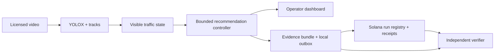

# Architecture and trust boundary

## Perception and control

The detector runs on the full image and cropped calibrated approach regions. IoU suppression merges repeated detections. The tracker assigns stable IDs where overlapping observations permit it. A track is estimated stopped after at least 1.5 seconds with small displacement relative to its image width. This is a visible-queue estimate, not calibrated physical speed or a complete intersection inventory.

The two demonstration approaches have incompatible green recommendations. The controller alternates A and B, uses smoothed demand (`4 * stopped + moving`) to bound green duration, and never directly transitions between incompatible greens. Yellow and all-red must complete. Timers are intentionally accelerated (2-5 seconds green, 1 second yellow, 1 second all-red) for this short clip. These are not approved road timings. Large timestamp gaps conservatively retain full observed clearance transitions.

Inference samples are spaced by video time, not CPU wall-clock time. The dashboard replays outputs aligned to the video. Real-time perception performance is not established. No physical command or acknowledgment is present; records describe recommendations only.

## Solana program

`register_run` initializes a PDA from `['run', authority, run_id]`. It pins publisher, intersection hash and policy commitment for that run. Anyone can register under their own authority; independent verifiers must pin the expected operator key. An arbitrary user's registry is not municipal approval.

`record_decision` requires the registered publisher's signature and an exact next sequence and previous commitment. Each receipt PDA is derived from `['receipt', registry, sequence_u64_le]`. There are no close or overwrite instructions. A transaction error rolls back initialized accounts. The registry advances its sequence/head only when recording succeeds.

Registry layout (including 8-byte discriminator): 192 bytes. Receipt: 184 bytes. Receipt fields: registry, publisher, sequence, evidence SHA-256, previous commitment, commitment and slot. Commitment = SHA-256(registry public-key bytes || sequence u64 little-endian || evidence hash || previous commitment). Initial previous commitment is 32 zero bytes.

The approved policy commitment binds controller settings, model hash, calibration-file hash, controller-source hash and perception-source hash. It does not verify inference on-chain. The evidence bundle includes run metadata and the actual timestamped observation/recommendation. Video is stored off-chain.

## Evidence serialization

UTF-8 JSON, sorted ASCII object keys, no whitespace, integer numeric units, Unicode string values emitted literally. Floats/nonfinite values are forbidden. Python and TypeScript share a test vector. Calibration polygons themselves use fractional coordinates but are committed as exact file bytes. Bounding boxes, scores (thousandths), timestamps and durations in evidence are integers.

## Verification limits

Checks establish expected publisher/policy and integrity of disclosed evidence. They do not establish honest cameras, correct counts, lawful physical timing, actual application, improvement in traffic flow, or a trustless oracle.

The program retains a development upgrade authority; a future upgrade could change program behavior. Devnet may reset and is not an archival service. A production design would need an explicit upgrade/retention policy, independently available evidence, institutional key custody, policy approval and operator controls. The present role keys are demo credentials, not an authenticated municipality.

Local control never waits for Solana. RPC errors produce pending publication; existing receipt PDAs allow idempotent recovery. `.secrets` is never served or committed. The backend binds to loopback and rejects processing requests from untrusted browser origins. It is a local demo service, not a publicly exposed authenticated municipal API.
